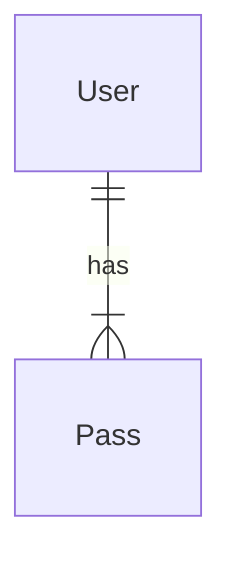

# Entities

## User

| Model | User  |
|--------|-------|
| Description|Stores user information |

| data | type | length | Constraints |
|------|------|--------|-------------|
|_id   |ObjectId| -  | PK Unique     |
|name  |String| min:5 max:60 | Non Null  |
|user  | String| min: 4 max:20| Unique Non Null|
|email | String| -     | Unique Non Null  |
|password| String| HASH| Non Null	 |
| profileImage| file   | 5MB | -       |
|living| Bool | -      |  - 		 |
|created| Date| - 	   | Non Null	 |

## Pass
| Model | Pass  |
|--------|-------|
| Description|Stores users passes |

| data | type | length | Constraints |
|------|------|--------|-------------|
| _id  |ObjectId| -    | PK Unique   |
| description|String| max: 200 | -	 |
| url | String| max: 200    | - 	 |
|password| String | - 		| Non Null   |
| cryptKey | String | -     | Non Null |
| userId | ObjectId | - | Foreign Key Non Null|


## Relationships


# API Routers
## User
### GET

**URL**: `/users/`
**Description**: Used to get all users
**Acess role**: Admin only
**Auth required** : YES


**URL**: `/users/:user`
**Description**: get user info by :user
**Acess role**: Users
**Auth required** : YES

**Data constraints**

```json
{
  "_id": "[ObjectId]",
  "name": "[valid user]",
  "user": "[valid name]",
  "email": "[valid email address]"
}
```

**Requests code**
- **200**: `Successfully`
- **404**: `Not Found or invalid entry for privided data`
- **500**: `Internal server error`

---

### POST

**URL**: `/users/signup/`
**Description**: Used to register users
**Acess role**: Allow
**Auth required** : NO

**Request example**

> POST
```json
{
  "name": "My Pass API",
  "user": "mypassapi",
  "email": "mypass@api.com",
  "password": "@pass123"
}
```
**Data example**
> GET

```json
{
  "user": {
    "_id": "123456789",
    "name": "My Pass API",
    "user": "mypassapi",
    "email": "mypass@api.com",
    "password": "<HASH DATA>",
    "living": "true"
  },
  "requests": {
	"type": "PATH/DELETE",
	"url": "/users/123456789"
  }
}
```

**Requests code**
- **201**: `Created user 'user' successfully`
- **500**: `Internal server error`

### PATCH

**URL**: `/users/:id`
**Description**: Used to change some user info
**Acess role**: User
**Auth required** : YES

**Request example**

> PATCH
```json
{
  "name": "name",
}
```


**URL**: `/users/:id/changeProfileImage/`
**Description**: Used to change user profile image
**Acess role**: User
**Auth required** : YES

**Request example**

> PATCH
```json
{
  "profileImage": "request.file.path",
}
```

**URL**: `/users/inactivate/:id/`
**Description**: Used to inactivate user
**Acess role**: User
**Auth required** : YES

**Request example**

> PATCH
```json
{
  "living": false,
}
```

**URL**: `/users/activate/:id/`
**Description**: Used to activate user
**Acess role**: User
**Auth required** : NO

**Request example**

> PATCH
```json
{
  "living": true,
}
```

**Request code**
- **200**: `Updated user 'user' successfully || Welcome back! 'user' is activated successfully! || User 'user' inactivated successfully!`
- **404**: `User not found`
- **500**: `Internal server error`

### DELETE

**URL**: `/users/:id/`
**Description**: Used to delete user
**Acess role**: Admin
**Auth required** : YES

**Response example**

> DELETE
```json
{
  "message": "User 'user' deleted successfully",
  "deletedUser": user
}
```

**Request code**
- **200**: `Successfully`
- **500**: `Internal server error`